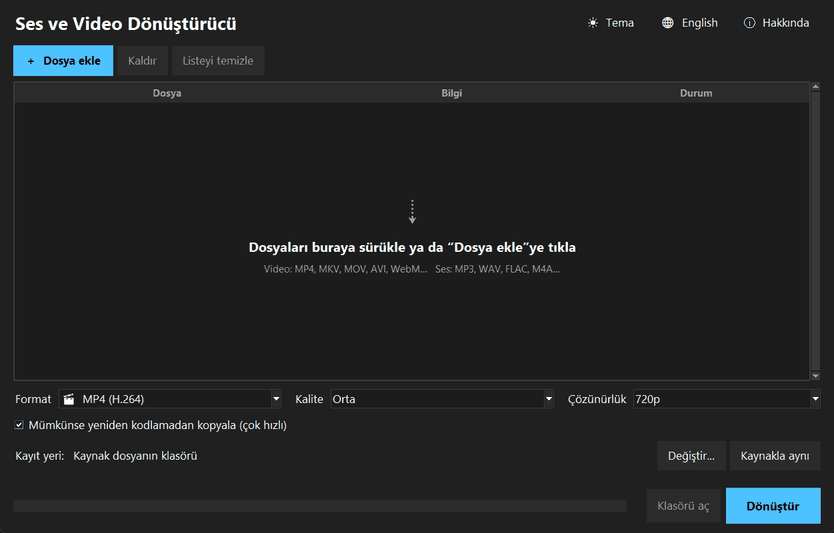
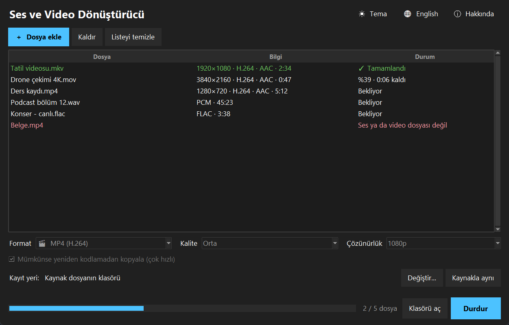
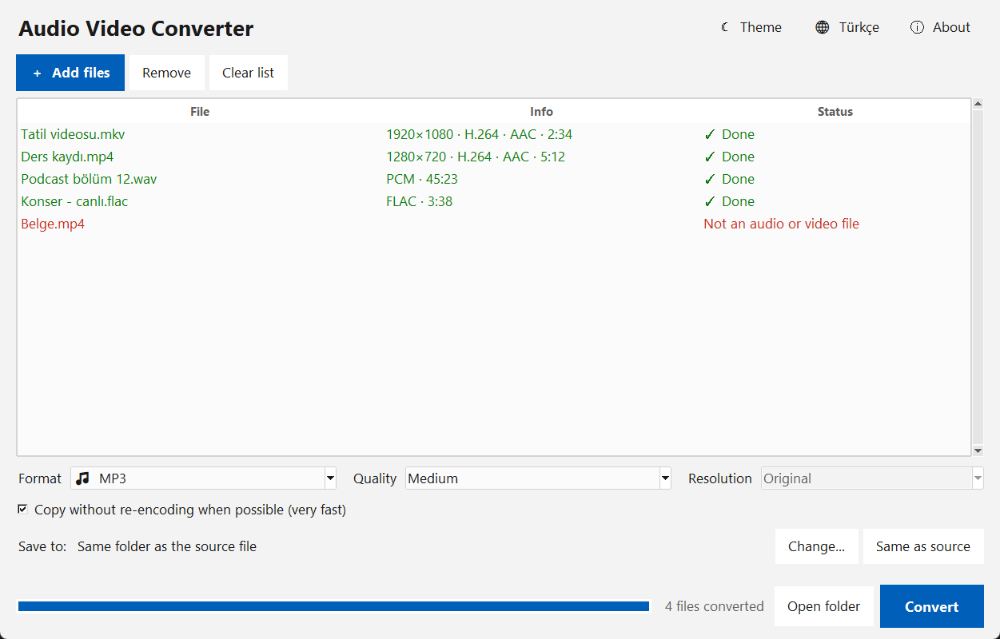
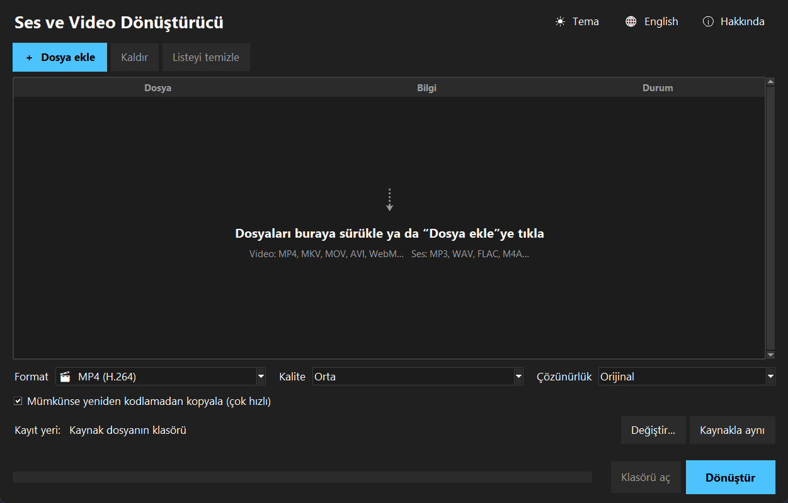

<p align="center">
  
</p>

<h1 align="center">Ses ve Video Dönüştürücü</h1>

<p align="center">
  <a href="README.md">English</a> | <b>Türkçe</b>
</p>

<p align="center">
  Python ve Tkinter ile yazılmış bir masaüstü ses ve video dönüştürücü. Arka planda FFmpeg'i çalıştırır;<br>
  onu hazır profilleri, kuyruğu ve gerçek ilerleme göstergesi olan, sürükle-bırakla kullanılan basit bir uygulamaya çevirir.
</p>

<p align="center">
  <a href="https://github.com/MrcDprm/audio-video-converter/releases/latest"><b>⬇️ Windows için indir</b></a>
</p>

<p align="center">
  
</p>

## Özellikler

**Dönüştürme**
- **Codec adı yerine hazır profiller:** Video için MP4, MKV, WebM ve MOV; ses için MP3, M4A, WAV, FLAC ve OGG
- **Videodan ses:** Bir ses formatı seçince videonun sesi çıkarılır
- **Kalite ve boyut:** Düşük / orta / yüksek kalite ve dosyayı küçültmek için 1080p, 720p ya da 480p (video asla büyütülmez)
- **Hızlı mod:** Kaynağın codec'leri hedef formata zaten uyuyorsa yeniden kodlamadan kopyalanır. 1080p bir MKV, dakikalar yerine bir saniyeden kısa sürede MP4 olur
- **Her yerde açılır:** Uyumlu renk biçimi ve `faststart` ile H.264 + AAC; dosyalar telefonda, tarayıcıda ve televizyonda açılır

**Kuyruk**
- Dosyaları ya da klasörleri pencereye sürükleyip bırak veya dosya seçme penceresini kullan
- Süre, çözünürlük ve codec'ler `ffprobe` ile okunup her dosyanın yanında gösterilir
- Dosyalar sırayla, yüzde ve kalan süreyle dönüştürülür; tek düğme kuyruğu durdurur
- Bozuk dosyalar, resimler ve medya olmayan diğer dosyalar dönüştürmeden önce tespit edilir

**Güvenlik**
- Var olan dosyaların üzerine asla yazılmaz: Çıktı `video (1).mp4`, `video (2).mp4`… diye adlandırılır
- Durdurulan ya da başarısız olan dönüştürmenin yarım dosyası silinir
- Dolu disk, yazma izni olmaması ve imkânsız dönüşümler (ör. MP3'ten MP4'e) için anlaşılır mesajlar
- Dönüştürme sürerken pencere kapatılırsa önce sorulur ve FFmpeg düzgünce durdurulur

**Arayüz**
- Kaynak dosyanın klasörüne ya da seçilen bir klasöre kaydetme
- Biten dosyaya çift tıklayınca Gezgin'de gösterilir
- Koyu ve açık tema, Türkçe ve İngilizce arayüz, hatırlanan ayarlar

**Diğer**
- FFmpeg ile gerçek dönüştürmeler dahil 37 test
- FFmpeg dahil kurulum sihirbazı: Başka hiçbir şey kurmak gerekmez

## Ekran Görüntüleri

**Kuyruk dönüştürülürken (koyu, Türkçe)**



| Ses çıkarma (açık, İngilizce) | Boş pencere |
|---|---|
|  |  |

## Kurulum

1. [Releases](https://github.com/MrcDprm/audio-video-converter/releases/latest) sayfasından `AudioVideoConverter-x.y.z-Setup.exe` dosyasını indir.
2. Çalıştır ve kurulum adımlarını izle. Yönetici izni gerekmez. FFmpeg kurulumla birlikte gelir.
3. Uygulamayı Başlat menüsünde **Ses ve Video Dönüştürücü** adıyla bul. Arayüz Türkçe açılır; sağ üstteki dil düğmesi İngilizceye çevirir.

> **Windows "Bilgisayarınız korundu" uyarısı:** Uygulama dijital olarak imzalı olmadığı için Windows SmartScreen ilk açılışta uyarı gösterebilir. **Ek bilgi → Yine de çalıştır** ile devam edebilirsin. Kaynak kodun tamamı bu depoda açık.

**Kaldırma:** Ayarlar → Uygulamalar → Yüklü uygulamalar → Ses ve Video Dönüştürücü → Kaldır.
Ayarlar `%USERPROFILE%\.audio-video-converter` klasöründe tutulur ve kaldırırken silinmez.

## Klavye Kısayolları

| Tuş | İşlev |
|---|---|
| `Ctrl+O` | Dosya ekle |
| `Delete` | Seçili dosyaları kaldır |
| `Ctrl+Enter` | Dönüştürmeyi başlat ya da durdur |

## Kullanılan Teknolojiler

- **Python 3.12** ve **Tkinter / ttk**: kullanıcı arayüzü
- **[FFmpeg](https://ffmpeg.org)** (`ffmpeg` ve `ffprobe`): dönüştürme ve dosya bilgisi, `subprocess` ile çalıştırılır
- **[tkinterdnd2](https://github.com/Eliav2/tkinterdnd2)**: sürükle-bırak
- **threading, queue**: dosya okuma ve dönüştürmeyi arka planda yapma
- **unittest**: testler
- **PyInstaller** ve **Inno Setup**: Windows kurulum dosyası

## Proje Yapısı

```
audio-video-converter/
├── main.py         # Giriş noktası, sürükle-bırak destekli pencere
├── gui.py          # Tkinter arayüzü: kuyruk, seçenekler, ilerleme
├── presets.py      # Çıktı formatları, kaliteler ve çözünürlükler
├── probe.py        # Dosya bilgisini ffprobe ile okur
├── command.py      # ffmpeg komutunu, hızlı modu ve çıktı adını oluşturur
├── progress.py     # ffmpeg ilerlemesini okur, kalan süreyi hesaplar
├── runner.py       # ffmpeg'i çalıştırır, durdurur, hataları sınıflar
├── settings.py     # Hatırlanan seçenekler
├── i18n.py         # Türkçe ve İngilizce metinler
├── storage.py      # JSON dosyalarını kullanıcı klasörüne kaydeder
├── app_info.py     # Uygulama adı, sürüm, FFmpeg'i bulma
├── scripts/        # Paketleme için doğrulanmış FFmpeg indirir
├── assets/         # Uygulama ikonu
├── docs/           # README görselleri
├── installer/      # Inno Setup betiği
└── tests/          # Testler
```

## Kaynak Koddan Çalıştırma

Python 3.12 veya daha yenisi ve `PATH`'te FFmpeg gerekir (ör. `winget install Gyan.FFmpeg`).

```bash
python -m pip install tkinterdnd2
python main.py           # uygulamayı çalıştır
python -m unittest -v    # testleri çalıştır (FFmpeg yoksa FFmpeg testleri atlanır)
```

### Kurulum dosyasını derleme

[PyInstaller](https://pyinstaller.org) ve [Inno Setup 6](https://jrsoftware.org/isinfo.php) gerekir.

```bash
python scripts/fetch_ffmpeg.py    # FFmpeg'i vendor/ klasörüne indirir ve SHA-256 özetini kontrol eder
python -m PyInstaller --noconfirm AudioVideoConverter.spec
ISCC installer/audio-video-converter.iss
```

Kurulum dosyası `installer/Output/` klasöründe oluşur.

**Yeni sürüm yayınlarken:** Sürüm numarasını hem `app_info.py` (`VERSION`) hem `installer/audio-video-converter.iss` (`AppVersion`) içinde güncelle, testleri çalıştır, derleme komutlarını çalıştır ve kurulum dosyasını yeni bir GitHub Release'e yükle.

## Öğrendiklerim

- **Başka bir programı güvenle çalıştırmak.** FFmpeg'i `subprocess` ile başlatmayı öğrendim. Komutu tek bir metin yerine liste olarak verdim; böylece bir dosya adı asla komut gibi yorumlanamıyor. Windows'ta konsol penceresinin açılmasını da engelledim.
- **Kap (container) ve codec farklı şeyler.** `.mkv` ya da `.mp4` sadece bir kutu; içindeki görüntü ve ses H.264, AAC gibi codec'lerle sıkıştırılmış. Bunu anlamak hızlı modu mümkün kıldı: Codec'ler zaten uyuyorsa sadece kutuyu değiştiriyorum ve dönüştürme dakikalar yerine saniyeler sürüyor.
- **Bir programın çıktısını o çalışırken okumak.** Gerçek yüzde ve kalan süreyi göstermek için FFmpeg'in `-progress` çıktısını satır satır okudum. Çıktı borularından biri okunmazsa tamponunun dolduğunu ve programın donduğunu da deneyerek öğrendim; bu yüzden hata çıktısını ikinci bir iş parçacığı okuyor.
- **Masaüstü uygulamasında arka plan işi.** Dosya okuma ve dönüştürme iş parçacıklarında (thread) çalışıyor ve sonuçlarını bir `queue` ile gönderiyor; pencereye sadece ana iş parçacığı dokunuyor. Böylece 4K bir video dönüşürken bile arayüz akıcı kalıyor.
- **Girdi dosyalarına güvenmemek.** Dosya uzantıları yalan söyleyebiliyor. Bu yüzden her dosya `ffprobe` ile kontrol ediliyor ve döndürdüğü her değer doğrulanıyor. Bozuk dosyalar, resimler ve boş dosyalar çökme yerine anlaşılır bir mesaj alıyor.
- **Kullanıcının dosyalarını korumak.** Çıktılar var olan dosyaların üzerine yazmıyor, dönüştürme durunca yarım dosyalar siliniyor ve uygulama kapanırken FFmpeg düzgünce durduruluyor.
- **Üçüncü taraf bir aracı dağıtmak.** FFmpeg'i kurulum dosyasına gömdüm, indirmeyi SHA-256 özetiyle doğruladım, FFmpeg'in GPL lisansını ve kaynak kodu linkini de yanına koydum. FFmpeg ayrı bir program olarak çalıştığı için kendi kodum MIT lisanslı kalıyor.
- **Gerçek araçla test etmek.** Birim testlerin yanında, küçük test videolarını FFmpeg'in kendisiyle üretip gerçekten dönüştürüyorum; ortada durdurmak da dahil.

## Gelecek Planları

- Kırpma (başlangıç ve bitiş zamanı)
- GIF çıktısı
- Donanım hızlandırma (NVIDIA NVENC, Intel Quick Sync)
- Altyazı gömme
- macOS ve Linux paketleri

## Lisans

[MIT](LICENSE) © 2026 Miraç Deprem

Kurulum dosyası GPL v3 lisanslı [FFmpeg](https://ffmpeg.org)'i ([gyan.dev](https://www.gyan.dev/ffmpeg/builds/) statik derlemesi) içerir. Lisans metni ve kaynak kodu linki, kurulumda `vendor` klasöründe yanında bulunur.
